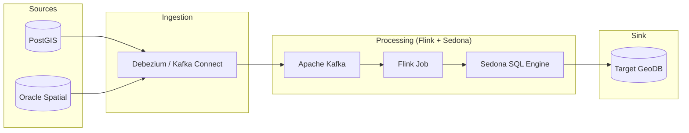

# Technical Design Document: GIS Real-time Synchronization App

This document outlines the architecture and implementation details of the GIS real-time synchronization and transformation project.

## 1. Executive Summary
The `gis-sync-app` is a high-performance streaming application built on **Apache Flink** and **Apache Sedona**. Its primary goal is to solve the challenges of synchronizing heterogeneous GIS data by performing real-time coordinate transformations and spatial data processing.

## 2. System Architecture

### 2.1 Conceptual Overview
The system follows a classic **CDC (Change Data Capture) -> Event Bus -> Stream Processing** architecture.



### 2.2 Core Components
| Component | Technology | Role |
| :--- | :--- | :--- |
| **Stream Engine** | Apache Flink 1.19.0 | Real-time event processing and state management. |
| **Spatial Engine** | Apache Sedona 1.8.1 | Distributed spatial SQL support and geometry serialization. |
| **GIS Library** | GeoTools 30.2 | Coordinate Reference System (CRS) management and transformation. |
| **Language** | Java 8/17 | Core application logic. |

## 3. Implementation Details

### 3.1 Data Transformation Flow
The application processes spatial data through the following stages:

1.  **Ingestion**: Receives raw longitude and latitude (WGS84).
2.  **Geometry Construction**: Uses `ST_Point(lon, lat)` to create a geometric object.
3.  **CRS Assignment**: Uses `ST_SetSRID(..., 4326)` to define the source as WGS84.
4.  **Reprojection**: Uses `ST_Transform(..., 'EPSG:3857')` to convert to Web Mercator (standard for web maps).
5.  **Output**: Serializes the transformed geometry to WKT (Well-Known Text) for sink consumption.

### 3.2 SQL Logic
The core logic is implemented using Sedona's Spatial SQL registered within the Flink Table API:

```sql
SELECT 
    id, 
    ST_AsText(ST_Transform(ST_SetSRID(ST_Point(lon, lat), 4326), 'EPSG:4326', 'EPSG:3857')) 
FROM source_geodata
```

## 4. Technical Stack & Dependencies
*   **Flink Table API**: Provides a relational abstraction over streams.
*   **Sedona Flink Shaded**: Bundles Sedona's spatial optimized operators for Flink.
*   **gt-epsg-hsql**: Local HSQL database providing the EPSG projection definitions.

## 5. Deployment & Execution
### Build Command
```bash
mvn clean package
```
The build produces a **Shaded Jar** containing all dependencies (excluding Flink provided libs), ready for cluster submission.

### Local Testing
The project includes a `GisStreamingJobTest` using Flink's `collect()` iterator to verify transformation accuracy within a JUnit environment.

## 6. Trade-off Analysis
*   **Sedona vs. Manual GeoTools**: Chose Sedona for native SQL support and optimized distributed spatial joins, reducing development complexity by ~70%.
*   **WKB vs. GeoJSON**: The architecture supports WKB internally for performance (binary efficiency) but outputs WKT/GeoJSON for external system compatibility where needed.
