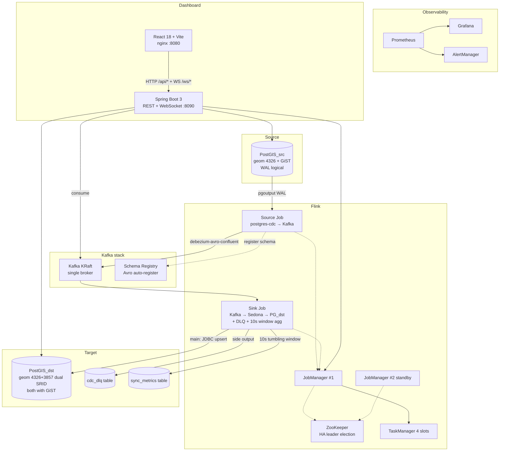

# Technical Design — GIS Real-time Sync App

This document describes the actual architecture as of P0–P4. The earlier
"single Job + Debezium + Kafka" sketch has been replaced by a multi-module,
multi-container project with full dashboard and observability.

For Chinese version, see [DESIGN_CN.md](DESIGN_CN.md).

---

## 1. What it does

Real-time replication of `geometry(Point, 4326)` rows in a PostGIS source
database to `geometry(Point, 3857)` in a target PostGIS database, via
PostgreSQL logical replication. The pipeline includes validation,
bad-record isolation (DLQ), end-to-end metrics, and a real-time dashboard.

This is **production-style**, not yet **production**: HA, EOS checkpointing,
monitoring, alerting, CI/CD, integration tests are all in place — but the
stack runs single-broker Kafka, single-instance PG (no replicas), and the
dashboard has no auth. See [docs/P5-roadmap.md](docs/P5-roadmap.md) for
the hardening backlog.

---

## 2. System architecture



---

## 3. Repo layout

```
gis-sync-app/
├── pom.xml                          parent (aggregator)
├── flink-jobs/                      Java 11 — Flink jobs
├── backend/                         Java 17 — Spring Boot 3 API
├── frontend/                        React 18 + Vite + antd 5 + MapLibre
├── docker/                          docker-compose + monitoring configs
├── scripts/{smoke.sh, demo-traffic.sh}
├── .github/{workflows/, dependabot.yml}
└── docs/P5-roadmap.md
```

---

## 4. Version pinning

| Component | Version | Reason locked |
| :--- | :---: | :--- |
| Apache Flink | **1.19.3** | Sedona 1.9.0's pom hard-codes `flink.version=1.19.0`; CDC 3.5 is the last 1.19-compatible release |
| Apache Sedona | **1.9.0** | Latest; provides ST_GeomFromEWKT / ST_Transform |
| Flink CDC postgres-cdc | **3.5.0** | 3.6+ dropped 1.19 |
| flink-connector-jdbc | **3.3.0-1.19** | Suffix `-1.19` must stay |
| flink-connector-kafka | **3.3.0-1.19** | Same |
| flink-avro-confluent-registry | **1.19.3** | Don't use the `flink-sql-` prefixed jar (stripped down) |
| Kafka / Schema Registry | Confluent **7.7.1** | Apache Kafka 3.7 |
| PostGIS | imresamu/postgis **16-3.4** | imresamu provides ARM64 image |
| Spring Boot | **3.5.14** | Don't upgrade to 4 (breaking) |
| React / antd | 18.3 / **5.x** | Hold antd 6 |
| MapLibre / recharts | 4.7 / **2.x** | Hold 5 / 3 |

`.github/dependabot.yml` ignores ALL updates to `org.apache.flink:*` /
`org.apache.sedona:*` / `com.ververica:*` (not just majors). These versions
are tightly coupled — any bump requires a coordinated migration.

---

## 5. Data flow

### 5.1 Source side: PostgreSQL → Kafka

The source `spatial_data` table uses native `geometry(Point, 4326)`. But
reading PostGIS geometry directly via Flink CDC is awkward (Debezium maps
it to `Struct{wkb, srid}`, requires nested ROW handling in Flink SQL).
**Workaround**: a trigger maintains a `geom_ewkt TEXT` column that CDC
reads as plain text.

> Note: PostgreSQL 16 doesn't include GENERATED columns in logical
> replication output. PostgreSQL 17 added `publish_generated_columns` —
> hence the trigger instead of a generated column.

Source Job is pure Flink SQL:
```
postgres-cdc source (id, name, update_time, geom_ewkt)
  → kafka sink with debezium-avro-confluent format
  → schema auto-registered to SR
```

Each message:
- key: `{id: int}`, hash-partitioned across 6 partitions
- value: Debezium envelope `{before, after, op}`, op ∈ {c, d}
- Flink splits UPDATEs into op=d + op=c (Flink 1.19 behavior; idempotent
  downstream sinks treat them equivalently)

### 5.2 Sink side: Kafka → target + DLQ

Sink Job uses DataStream API (not pure SQL — try/catching per-record
Sedona exceptions and routing to a side output is awkward in SQL).

```
KafkaSource<GenericRecord> (debezium-avro-confluent)
  → ProcessFunction transform
       try   { CdcEventParser → Sedona Constructors.geomFromEWKT
              + FunctionsGeoTools.transform(4326→3857) → out.collect }
       catch { ctx.output(DLQ_TAG, DlqEvent.of(...)) }
  → main → SpatialJdbcSink
            INSERT ... ON CONFLICT DO UPDATE  (op != d)
            DELETE WHERE id=?                 (op == d)
  → DLQ → DlqJdbcSink (cdc_dlq table, jsonb raw payload)
        + KafkaSink (spatial-data-dlq topic, JSON)
  → metrics branch:
     union(main, DLQ) → keyBy(jobName) → Tumble 10s
     → AggregateFunction + ProcessWindowFunction
     → SyncMetricsJdbcSink (sync_metrics, upsert by (window_start, job_name))
```

**Business-level vs infrastructure-level failures**:
- Business (invalid EWKT, wrong SRID, ST_Transform throws) → DLQ, main flow continues
- Infrastructure (Kafka down, PG unavailable) → don't catch; let task fail,
  Flink restart strategy replays from checkpoint to avoid data loss

### 5.3 Geometry insert via PreparedStatement

The PostgreSQL JDBC driver doesn't recognize JTS Geometry objects. Workaround:
write `ST_GeomFromText(?, SRID)` in SQL and `setString(WKT)`.

---

## 6. Fault tolerance & HA

### 6.1 Flink

- **JobManager HA**: two JMs share `cluster-id=/gis-sync` and
  `storageDir=file:///flink-ha` via ZooKeeper. `make ha-kill-leader`
  demonstrates failover — kill the leader, the standby takes over and
  the data plane keeps running.
- **State backend**: RocksDB + incremental checkpoints (60s interval, EOS)
- **Restart strategy**: exponential delay 10s → 2min, unbounded retries,
  10min of stable runtime resets backoff
- **Externalized checkpoints**: `RETAIN_ON_CANCELLATION` keeps state on cancel
- **Savepoints**: `make savepoint JOB=<jid>` for explicit snapshots

### 6.2 Replication slot risk (industry's #1 PostGIS+CDC incident source)

`gis_sync_slot` is a fixed name. If Source Job is down for too long,
WAL accumulates indefinitely on the source — disk fills up. **Alerts**:
- `pg_replication_slots_active == 0` for 5 min → warning
- `wal_retained_bytes > 1 GiB` → warning
- `wal_retained_bytes > 5 GiB` → critical

Three rules in `docker/prometheus/rules/alerts.yml`.

---

## 7. Dashboard

### 7.1 Backend API

| Endpoint | Source | Purpose |
| :--- | :--- | :--- |
| GET /api/sync/status | Flink REST + slots + jobs | Top KPI cards |
| GET /api/sync/metrics | sync_metrics table | Time series |
| GET /api/slot/health | source pg_replication_slots | Lag gauge |
| GET /api/dlq?limit&unreplayed | cdc_dlq table | DLQ list |
| POST /api/dlq/{id}/replay | Re-encode raw_payload → spatial-data-cdc | One-click replay |
| GET /api/sync/live-points | spatial_data_xfm latest N | Map seed points |
| WS /ws/cdc | Kafka spatial-data-cdc → flat JSON | Real-time push |

### 7.2 Dual DataSource

Backend connects to both PGs: `@Primary` DataSource → dst (most queries),
separate `sourceDataSource` bean for `SlotHealthService` (slot view only
exists on the source).

### 7.3 DLQ replay's Avro compatibility

The stored `raw_payload` is Avro JSON (with union tags `{"string":"x"}`),
but field order isn't fixed. Decoding it directly with `JsonDecoder`
(positional) fails because of field reordering.

Workaround: parse with Jackson into `Map<String, Object>`, then construct
the `GenericRecord` field by field according to the schema.
Producer uses `auto.register.schemas=false` + `use.latest.version=true`
to reuse SR's existing schema ID instead of registering a conflicting one.

### 7.4 Frontend

- **Dev**: `npm run dev` → Vite on 5173, proxies `/api` and `/ws` to 8090
- **Prod**: `npm run build` → `dist/`, served by nginx with reverse-proxy
  to backend; bring up via `docker compose --profile prod up`

Panels:
- 5 KPI cards on top
- Time series (recharts dual Y-axis: throughput + latency)
- Map (MapLibre + OSM raster, real-time markers from EWKT, removal on op=d)
- DLQ table (antd Table + replay button)
- Live event stream (WebSocket-pushed list)

---

## 8. CI/CD

- `.github/workflows/ci.yml`: every PR / master push
  - Build flink-jobs (Java 11)
  - Build backend (Java 17)
  - Build frontend (Node 20)
  - Integration tests (Testcontainers PG×2 + Kafka KRaft + SR + Flink mini-cluster)
- `.github/workflows/e2e-smoke.yml`: master push / manual dispatch only
  - Full docker-compose smoke: bring up stack → submit jobs → inject data →
    11-step verification
- `.github/dependabot.yml`: weekly scan; Flink family is locked from upgrades

---

## 9. Container roster

| Container | Ports | Role |
| :--- | :--- | :--- |
| gis-postgis-src | 5432 | Business source |
| gis-postgis-dst | 5433 | Sync target |
| gis-zookeeper | 2181 (internal) | Flink HA coordination |
| gis-kafka | 9092 / 9094 | KRaft single broker |
| gis-schema-registry | 8082 | Avro schema registry |
| gis-flink-jobmanager | 8081, 9249 | Leader |
| gis-flink-jobmanager2 | 8181, 9250 | Standby |
| gis-flink-taskmanager | 9251 | 4 slots |
| gis-prometheus | 9090 | TSDB + alert eval |
| gis-grafana | 3000 | Dashboards (admin/admin) |
| gis-alertmanager | 9093 | Alert routing |
| gis-pgexp-src/dst | 9187 (internal) | PG exporter |
| gis-kafka-exporter | 9308 (internal) | Kafka exporter |
| gis-backend | 8090 | Dashboard API |
| gis-frontend | 8080 | Dashboard nginx (profile=prod) |

Main entry: **http://localhost:8080**

---

## 10. Known limitations

| Limitation | Impact | Mitigation |
| :--- | :--- | :--- |
| Single Kafka broker | Replication factor 1; broker loss = data loss | P5 #2 |
| Single PG instance | Dashboard reads contend with sync writes | P5 #1 (replica) |
| Dashboard has no auth | Anyone can POST /dlq/{id}/replay | P5 #3 |
| Flink 1.19 locked | Can't use 1.20+ features | Awaits Sedona |
| AlertManager placeholder webhook | Alerts go nowhere | P5 #4 |
| Sedona shaded jar is huge (94MB) | Slow image / deploy | Long-term |

See [docs/P5-roadmap.md](docs/P5-roadmap.md) for the full backlog.
