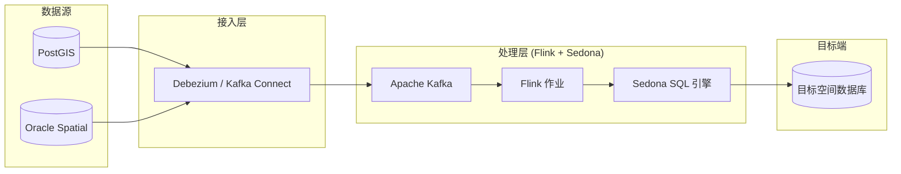
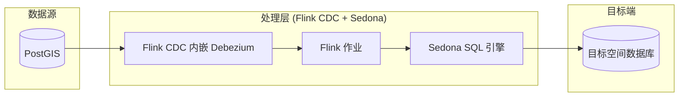

# 技术设计文档：GIS 实时同步与转换应用

本文档概述了 GIS 实时同步与转换项目的架构设计与实现细节。

## 1. 执行摘要
`gis-sync-app` 是一个基于 **Apache Flink** 和 **Apache Sedona** 构建的高性能流处理应用程序。其核心目标是解决异构 GIS 数据同步中的挑战，实现实时的坐标系转换和空间数据处理。

## 2. 系统架构

### 2.1 概念视图

系统支持两种接入架构：

**方案 A：经典 CDC 架构（Debezium + Kafka）**



**方案 B：Flink CDC 直连架构（推荐，减少运维组件）**



方案 B 通过 `GisStreamingJobCdc` 实现，省去了独立的 Kafka 集群和 Debezium Connect Worker，降低端到端延迟和运维成本。

### 2.2 核心组件
| 组件 | 技术选型 | 角色 |
| :--- | :--- | :--- |
| **流处理引擎** | Apache Flink 1.19.0 | 提供实时事件处理和状态管理。 |
| **空间计算引擎** | Apache Sedona 1.8.1 | 提供分布式空间 SQL 支持和几何对象序列化优化。 |
| **GIS 基础库** | GeoTools 30.2 | 负责坐标参考系 (CRS) 管理和投影转换算法。 |
| **CDC 引擎** | Flink CDC 3.0.1 | 内嵌 Debezium，直连 PostGIS 捕获变更。 |
| **开发语言** | Java 11/17 | 编写核心业务逻辑。 |

## 3. 实现细节

### 3.1 数据转换流程
应用程序通过以下阶段处理空间数据：

1.  **数据接入**：接收原始经纬度数据 (WGS84)。
2.  **坐标验证**：过滤无效坐标（超范围、零值），防止脏数据进入转换流程。
3.  **几何体构建**：使用 `ST_Point(lon, lat)` 构建几何对象。
4.  **坐标系分配**：使用 `ST_SetSRID(..., 4326)` 显式指定源坐标系为 WGS84。
5.  **投影转换**：使用 `ST_Transform(..., 'EPSG:3857')` 转换为 Web 墨卡托投影（互联网地图标准）。
6.  **结果输出**：将转换后的几何体序列化为 WKT (Well-Known Text) 格式供下游消费（支持 JDBC Sink 写入目标数据库）。

### 3.2 SQL 核心逻辑
核心逻辑通过在 Flink Table API 中注册 Sedona 空间函数实现：

```sql
SELECT
    id,
    ST_AsText(ST_Transform(ST_SetSRID(ST_Point(lon, lat), 4326), 'EPSG:4326', 'EPSG:3857'))
FROM source_geodata
WHERE lon BETWEEN -180 AND 180
  AND lat BETWEEN -90 AND 90
  AND NOT (lon = 0.0 AND lat = 0.0)
```

### 3.3 地理围栏空间 Join（GeofenceStreamingJob）
通过 `ST_Contains` + `TUMBLE` 窗口实现实时地理围栏判断与区域密度统计：

```sql
SELECT g.area_id, g.area_name,
    TUMBLE_END(v.event_time, INTERVAL '1' MINUTE) AS window_end,
    COUNT(DISTINCT v.vehicle_id) AS vehicle_count
FROM vehicle_positions v
CROSS JOIN geofence_areas g
WHERE ST_Contains(ST_GeomFromWKT(g.wkt_polygon), ST_Point(v.lon, v.lat))
GROUP BY g.area_id, g.area_name, TUMBLE(v.event_time, INTERVAL '1' MINUTE)
```

## 4. 技术栈与依赖说明
*   **Flink Table API**：在流之上提供关系型抽象，便于编写类 SQL 逻辑。
*   **Sedona Flink Shaded**：集成了 Sedona 针对 Flink 优化的空间算子。
*   **gt-epsg-hsql**：内置的 HSQL 数据库，提供全球标准的 EPSG 投影定义。
*   **Flink CDC**：内嵌 Debezium 引擎，直连 PostGIS 捕获 WAL 变更，无需独立 Kafka 集群。
*   **Kryo 序列化器**：为 JTS Geometry 类型注册专用序列化器，减少约 2/3 的序列化开销。

## 5. 部署与执行
### 编译命令
```bash
mvn clean package
```
编译后将生成一个 **Shaded Jar**，包含了除 Flink 核心库之外的所有依赖，可直接提交至集群运行。

### 本地测试
项目包含 `GisStreamingJobTest` 单元测试，利用 Flink 的 `collect()` 迭代器在 JUnit 环境下验证转换精度。

## 6. 权衡分析 (Trade-off)
*   **Sedona vs. 手动集成 GeoTools**：选择 Sedona 是因为它提供了原生的 SQL 支持和优化的分布式空间 Join，将开发复杂度降低了约 70%。
*   **WKB vs. GeoJSON**：系统内部支持 WKB 以保证处理性能（二进制效率），但在输出端支持 WKT/GeoJSON 以确保与外部系统的兼容性。
