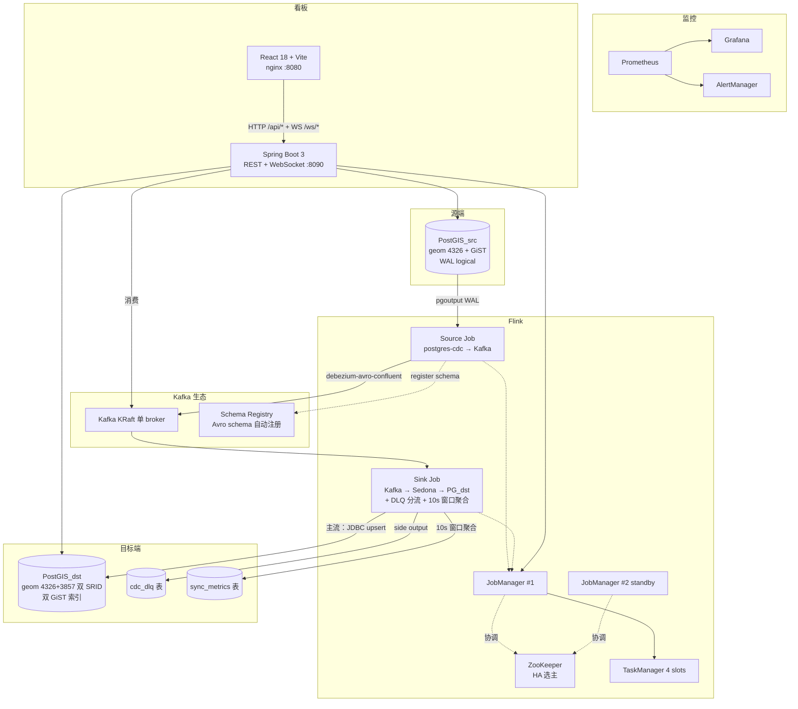

# 技术设计：GIS 实时同步应用

本文档描述当前项目（P0–P4 完成版）的真实架构。早期版本的"单 Job + Debezium + Kafka"
方案已经被多模块、多容器、含看板与监控的工程取代。

---

## 1. 项目定位

把一个 PostGIS 业务库里 `geometry(Point, 4326)` 数据的 INSERT/UPDATE/DELETE
通过逻辑复制实时投影到另一个 PostGIS 库的 `geometry(Point, 3857)`，
同步链路上含数据校验、坏数据隔离（DLQ）、端到端指标采集和实时看板。

不是 demo 是 **演示生产级**：HA、checkpoint EOS、监控告警、CI/CD、集成测试齐全；
但**不是真生产**：单 Kafka broker、单 PG 实例（无副本）、看板无认证。
P5 路线见 [docs/P5-roadmap.md](docs/P5-roadmap.md)。

---

## 2. 系统架构



---

## 3. 模块结构

```
gis-sync-app/
├── pom.xml                          parent (aggregator)
├── flink-jobs/                      Flink 子模块（Java 11）
│   └── src/main/java/com/example/gis/
│       ├── source/SourceCdcToKafkaJob.java     PG WAL → Kafka Avro
│       ├── sink/KafkaToSinkJob.java            Kafka → Sedona → PG_dst + DLQ
│       ├── sink/{Spatial,Dlq,SyncMetrics}JdbcSink.java
│       └── common/{EnvUtils,FlinkEnvConfigurer}.java
├── backend/                         Spring Boot 子模块（Java 17）
│   └── src/main/java/com/example/gis/backend/
│       ├── api/                      6 个 REST + 1 个 WebSocket 端点
│       ├── kafka/                    DLQ 重投 + WS 推流
│       ├── service/                  DB / Flink REST 客户端
│       └── config/                   双 DataSource / WebSocket / Kafka
├── frontend/                        React + Vite + antd + MapLibre
├── docker/
│   ├── docker-compose.yml          12 + 1（init）+ 1（prod-only frontend）
│   ├── init-src.sql / init-dst.sql
│   ├── fetch-libs.sh                运行时 jar 下载
│   └── prometheus/ grafana/ alertmanager/ nginx-frontend.conf
├── scripts/
│   ├── smoke.sh                     11 步端到端冒烟
│   └── demo-traffic.sh              持续模拟同步流量
├── .github/
│   ├── workflows/{ci,e2e-smoke}.yml
│   └── dependabot.yml
└── docs/
    └── P5-roadmap.md
```

---

## 4. 关键技术决策与版本锁定

| 组件 | 版本 | 锁定原因 |
| :--- | :---: | :--- |
| Apache Flink | **1.19.3** | Sedona 1.9.0 在 pom 里钉死 `flink.version=1.19.0`；CDC 3.5 是最后兼容 1.19 的版本 |
| Apache Sedona | **1.9.0** | 当前最新；提供 ST_GeomFromEWKT / ST_Transform |
| Flink CDC postgres-cdc | **3.5.0** | 3.6+ 砍了 1.19 支持 |
| flink-connector-jdbc | **3.3.0-1.19** | 后缀必须保持 -1.19 |
| flink-connector-kafka | **3.3.0-1.19** | 同上 |
| flink-avro-confluent-registry | **1.19.3** | 不要用 `flink-sql-avro-confluent-registry`（裁剪版） |
| Kafka / Schema Registry | Confluent **7.7.1** | 对应 Apache Kafka 3.7 |
| PostGIS | imresamu/postgis **16-3.4** | imresamu 提供 ARM64 镜像 |
| Spring Boot | **3.5.14** | 不升 4（API 大改） |
| React / antd | 18.3 / **5.x** | 不升 antd 6 |
| MapLibre / recharts | 4.7 / **2.x** | 不升 5/3 |

`.github/dependabot.yml` 里把 `org.apache.flink:*` / `org.apache.sedona:*` /
`com.ververica:*` 全部 ignore（不只屏蔽 major），这几套版本绑定紧密，
任何升级都需要"整套迁移"评估。

---

## 5. 数据流详解

### 5.1 Source 端：PostgreSQL → Kafka

源表 `spatial_data` 用原生 `geometry(Point, 4326)` 列。但 Flink CDC 直接读
PostGIS geometry 类型很麻烦（Debezium 转 Struct{wkb, srid}，Flink SQL 端要 ROW
嵌套处理）。**绕开方式**：trigger 维护一个 `geom_ewkt TEXT` 列，CDC 读这个文本列
就够用。

> 注：PG 16 的逻辑复制不发布 GENERATED 列，PG 17 才有 `publish_generated_columns`
> 配置项。所以用 trigger 而不是 generated column。

Source Job 用纯 Flink SQL：
```
postgres-cdc source（id, name, update_time, geom_ewkt）
  → kafka sink with debezium-avro-confluent format
  → 自动把 schema 注册到 SR
```

每条消息：
- key：`{id: int}`，按 hash 分到 6 个 partition
- value：Debezium envelope `{before, after, op}`，op ∈ {c, d}
- Flink 把 UPDATE 自动拆成 op=d + op=c 两条事件（这是 Flink 1.19 行为，下游幂等 sink 等价处理）

### 5.2 Sink 端：Kafka → Target + DLQ

Sink Job 用 DataStream API（不是纯 SQL，因为要 try/catch 单条记录的 Sedona 异常
并 side output 到 DLQ，SQL 路径里很别扭）。

```
KafkaSource<GenericRecord>（debezium-avro-confluent）
  → ProcessFunction transform
       try   { CdcEventParser → Sedona Constructors.geomFromEWKT
              + FunctionsGeoTools.transform(4326→3857) → out.collect }
       catch { ctx.output(DLQ_TAG, DlqEvent.of(...)) }
  → 主流 → SpatialJdbcSink
            INSERT ... ON CONFLICT DO UPDATE （op != d）
            DELETE WHERE id=?           （op == d）
  → DLQ 流 → DlqJdbcSink（cdc_dlq 表，jsonb 存原始 payload）
           + KafkaSink（spatial-data-dlq topic，JSON 格式）
  → 业务指标支链：
     union(主流, DLQ) → keyBy(jobName) → Tumble 10s
     → AggregateFunction 增量计数 + Process 注入窗口元信息
     → SyncMetricsJdbcSink（sync_metrics 表，按 (window_start, job_name) upsert）
```

**业务级失败 vs 基础设施级失败**：
- 业务级（无效 EWKT、SRID 错、ST_Transform 抛异常）→ DLQ，主流不阻塞
- 基础设施级（Kafka 断、PG 宕）→ 不要 catch，让 task 失败 → Flink restart strategy
  从 checkpoint 回放，避免丢数据

### 5.3 几何字段的 PreparedStatement 写入

PG JDBC driver 不识别 JTS Geometry 对象。绕开：在 SQL 里写
`ST_GeomFromText(?, SRID)`，PreparedStatement.setString 传 WKT 文本。

---

## 6. 容错与 HA

### 6.1 Flink 层

- **JobManager HA**：双 JM 通过 ZooKeeper 共享 `cluster-id=/gis-sync` 和 `storageDir=file:///flink-ha`
  实现选主。`make ha-kill-leader` 演示故障转移：杀 leader 后数据面在 standby 接管期间不中断。
- **State backend**：RocksDB + 增量 checkpoint（checkpoint 60s 间隔，EOS 语义）
- **Restart strategy**：指数退避，10s → 2min，重试不限次数但 10min 无失败重置 backoff
- **Externalized checkpoint**：`RETAIN_ON_CANCELLATION`，Job 取消保留 checkpoint
- **Savepoint**：`make savepoint JOB=<jid>` 主动备份

### 6.2 PG 复制槽风险（业界 #1 PostGIS+CDC 事故源）

`gis_sync_slot` 是固定名。如果 Source Job 长时间不启动，PG 这边 WAL 永不释放，
磁盘会涨爆。**监控**：
- `pg_replication_slots_active == 0` 持续 5 分钟 → warning
- `wal_retained_bytes > 1 GiB` → warning
- `wal_retained_bytes > 5 GiB` → critical

3 条规则在 `docker/prometheus/rules/alerts.yml`。

---

## 7. 看板架构

### 7.1 后端 API

| 端点 | 数据来源 | 用途 |
| :--- | :--- | :--- |
| GET /api/sync/status | Flink REST + 复制槽 + jobs | 顶部 KPI 卡 |
| GET /api/sync/metrics | sync_metrics 表 | 时序图 |
| GET /api/slot/health | 源库 pg_replication_slots | 滞后量 |
| GET /api/dlq?limit&unreplayed | cdc_dlq 表 | DLQ 列表 |
| POST /api/dlq/{id}/replay | 反序列化 raw_payload → 写 spatial-data-cdc | 一键重投 |
| GET /api/sync/live-points | spatial_data_xfm 最新 N 条 | 地图初始打点 |
| WS /ws/cdc | 订阅 Kafka spatial-data-cdc → JSON | 实时推流 |

### 7.2 双 DataSource

backend 同时连两个 PG：默认 `@Primary` DataSource 走 dst（看板查询绝大多数走这里），
独立的 `sourceDataSource` bean 给 `SlotHealthService` 用——slot 视图只在源库可见。

### 7.3 DLQ 重投的 Avro 兼容

raw_payload 当初是 Avro JSON 编码（含 union 标签 `{"string":"x"}`），但 JSON 字段顺序
不固定。直接用 `JsonDecoder` 按位置反序列化会因字段错位失败。

修法：Jackson 解析成 Map → 按 schema 字段名手动构造 GenericRecord。
producer 用 `auto.register.schemas=false` + `use.latest.version=true`，复用 SR 已有 schema id。

### 7.4 前端

- **dev**：`npm run dev` 起 Vite 5173，proxy `/api` `/ws` 到 8090
- **生产**：`npm run build` 出 dist/，nginx serve + 反代 backend，docker compose `--profile prod up`

主要面板：
- 顶部 5 个 KPI 卡
- 时序折线（recharts 双 Y 轴：吞吐 + 延迟）
- 地图（MapLibre + OSM 光栅，按 EWKT 实时打点，op=d 移除 marker）
- DLQ 表（antd Table + 重投按钮）
- 实时变更流（WS 推送列表）

---

## 8. CI/CD

- `.github/workflows/ci.yml`：每 PR / master push 跑
  - Build flink-jobs (Java 11)
  - Build backend (Java 17)
  - Build frontend (Node 20)
  - Integration tests（Testcontainers PG ×2 + Kafka KRaft + SR + Flink mini-cluster）
- `.github/workflows/e2e-smoke.yml`：仅 master push / 手动 trigger
  - 完整 docker compose smoke：起栈 → 提作业 → 注入数据 → 验证 11 步
- `.github/dependabot.yml`：周扫，已锁住 Flink 系列禁止升级

---

## 9. 容器清单（端口矩阵）

| 容器 | 端口 | 用途 |
| :--- | :--- | :--- |
| gis-postgis-src | 5432 | 业务源库 |
| gis-postgis-dst | 5433 | 同步目标库 |
| gis-zookeeper | 2181 (内部) | Flink HA 协调 |
| gis-kafka | 9092 / 9094 | KRaft 单 broker |
| gis-schema-registry | 8082 | Avro schema 中心 |
| gis-flink-jobmanager | 8081, 9249 | leader |
| gis-flink-jobmanager2 | 8181, 9250 | standby |
| gis-flink-taskmanager | 9251 | 4 slots |
| gis-prometheus | 9090 | TSDB + 告警评估 |
| gis-grafana | 3000 | 看板（admin/admin） |
| gis-alertmanager | 9093 | 告警分发 |
| gis-pgexp-src/dst | 9187 (内部) | PG exporter |
| gis-kafka-exporter | 9308 (内部) | Kafka exporter |
| gis-backend | 8090 | 看板 API |
| gis-frontend | 8080 | 看板 nginx（profile=prod） |

主入口：**http://localhost:8080**

---

## 10. 已知限制

| 限制 | 影响 | 缓解 |
| :--- | :--- | :--- |
| 单 Kafka broker | 副本因子=1，broker 挂数据全失 | P5 #2 |
| 单 PG 实例 | 看板查询冲击同步主写 | P5 #1 加 replica |
| 看板无认证 | 任何人都能 POST /dlq/{id}/replay | P5 #3 |
| Flink 1.19 锁死 | 不能用 1.20+ 新特性 | 等 Sedona 跟进 |
| AlertManager 占位 webhook | 告警不会通知到人 | P5 #4 |
| Sedona shaded jar 巨大（94MB） | 镜像/部署慢 | 长期问题 |

详见 [docs/P5-roadmap.md](docs/P5-roadmap.md)。
